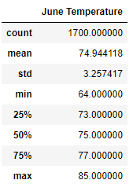
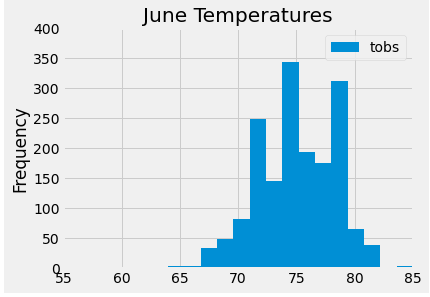
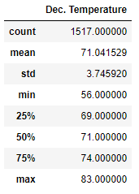
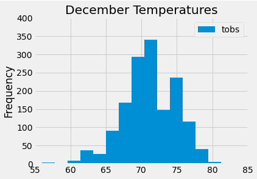
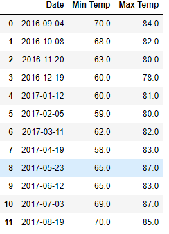

# Surfs Up
## Overview
- In this project I used Pythin, pandas and SQL to filter the data and create tables in sqlite database. 
- The data was used to create graphs that compared the months of June and December, to determine if the weather was adaquate to open a Surf and Ice Cream Shop. 

## Results

## Comparision
- The differences between June and december are very slight decrease in temperature in December:
    - Mean decrease by 3.9
    - Minimum Temperature decrease by 8
    - Maximum Temperature decrease by 2
    - Standard Deviation increased by .5 for December. 

Calculating the minimum and maximum temperatures for a one year period from 9/2016 to 8/2017. 

    - Lowest Average Tempurature = 58.0
    - Highest Average Temperature = 87.0

## Summary

The data shoes that the June temperatures are slightly higher than December, but the difference is small. 

The tempuratures remain fairly consistant through out the year as shown in the additioanl analysis of minimum and maximus temperature. The histograms provide a visual to assist the client in seeing the consistance of temperatures.  These anaylsis show that this location excellent for a Surf and Ice Cream shop.  

Further study would want to look at the other economic factures that would effect the profitability of the shop, such as current competition, supply and cost analysis